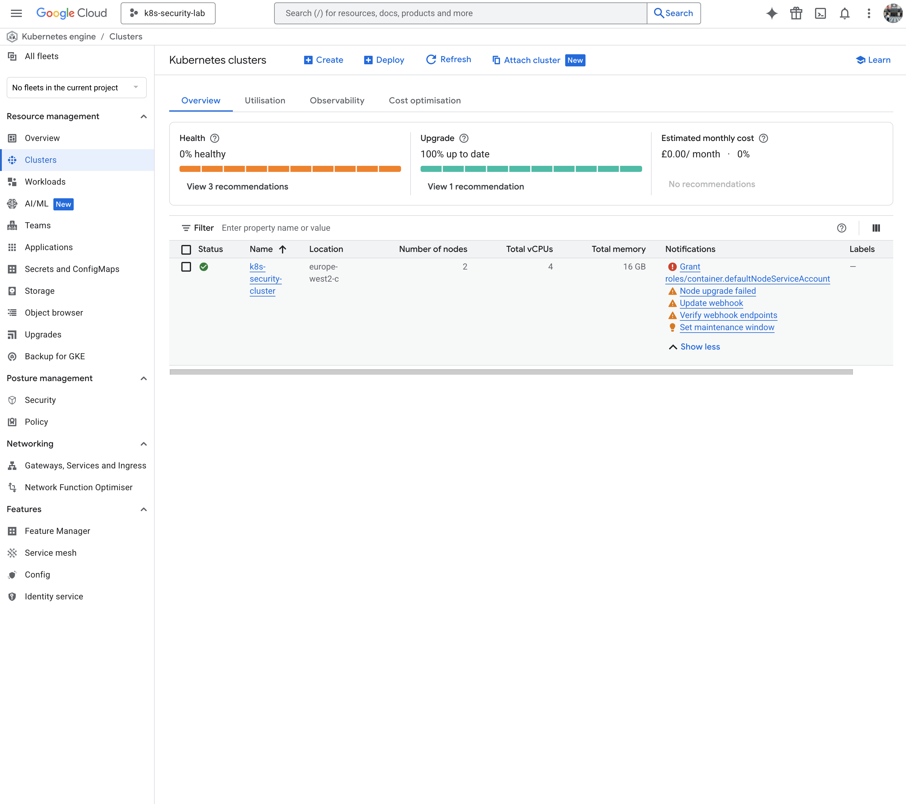
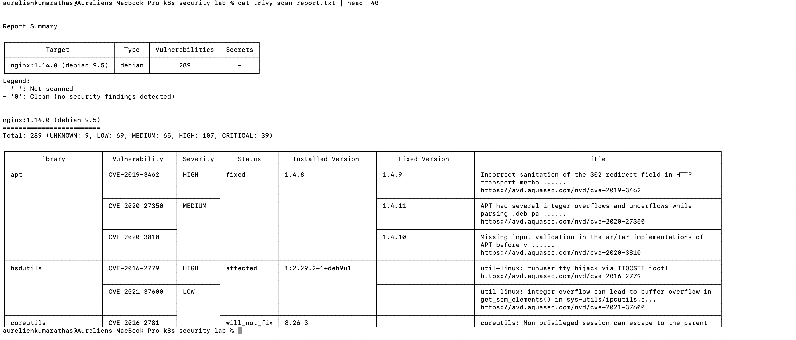
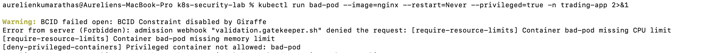
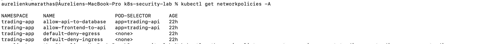
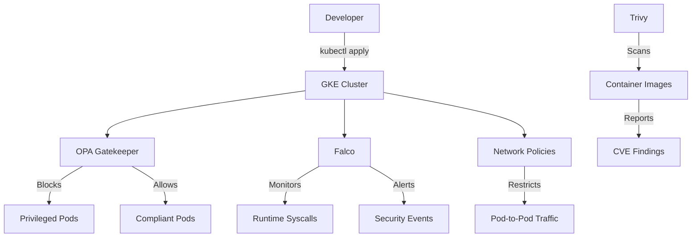

# Kubernetes Security Hardening — GCP/GKE Portfolio Project
...
# 🔐 Kubernetes Security Hardening on GKE


> End-to-end Kubernetes security hardening project on GCP — covering vulnerability scanning, policy enforcement, runtime threat detection, network segmentation and RBAC auditing.

---

## 📸 Screenshots

| GKE Cluster Running | Trivy Vulnerability Scan |
|---|---|
|  |  |

| Gatekeeper Blocking Privileged Pod | Network Policies Deployed |
|---|---|
|  |  |

---

## ✅ Features

- 🔍 Container image scanning with **Trivy** — identified 39 CRITICAL CVEs on nginx:1.14.0
- 🛡️ Policy-as-code enforcement with **OPA Gatekeeper** — blocks privileged pods and root containers
- 🌐 **Network Policies** — least-privilege pod-to-pod traffic control
- 👤 **RBAC Audit** — full export and review of all roles and bindings across namespaces
- 🚨 **Falco** custom detection rules — shell spawning, sensitive file access, privilege escalation
- 📦 SBOM generation and SARIF reporting for supply chain visibility

---

## ⚡ Quick Start

```bash
git clone https://github.com/AurelienKumarathas/k8s-security-lab.git
cd k8s-security-lab
trivy image nginx:1.14.0
kubectl apply -f policies/gatekeeper/
kubectl apply -f policies/network-policies/
kubectl apply -f policies/rbac/
```

---

## 🛠️ Prerequisites

- GCP account with GKE enabled
- `gcloud` CLI authenticated
- `kubectl` configured against your cluster
- `trivy` installed locally (`brew install trivy`)
- Helm 3+

---

## 📁 Repo Structure

```
k8s-security-lab/
├── evidence/              # Trivy reports, SARIF, SBOM, Falco alerts
├── manifests-insecure/    # Intentionally vulnerable manifests for policy testing
├── policies/              # Gatekeeper, network policies, RBAC, Falco rules
├── screenshots/           # GCP Console and CLI evidence
└── gatekeeper-library/    # OPA Gatekeeper policy library
```

---

## 🏗️ Architecture



---

## 💼 Skills Demonstrated

| Skill | Tool | Relevance |
|---|---|---|
| Vulnerability Management | Trivy | Shift-left security, CVE triage |
| Policy-as-Code | OPA Gatekeeper | Automated compliance enforcement |
| Runtime Threat Detection | Falco | SIEM/SOC alerting, incident response |
| Network Segmentation | Kubernetes Network Policies | Zero-trust architecture |
| RBAC Hardening | Kubernetes RBAC | Least-privilege access control |
| Cloud Security | GKE / GCP | Cloud-native security posture |
| Supply Chain Security | SBOM, SARIF | DevSecOps pipeline integration |

---

## ⚠️ Notes on Falco

Falco was deployed via Helm using the `modern_ebpf` driver. GKE's hardened Chromium OS kernel (v6.12.55+) prevented the eBPF probe from attaching. Falco pods ran but syscall monitoring did not initialise — this is a known GKE limitation. Custom rules were authored and are in `policies/`. Production fix: dedicated node pool with a supported kernel, or native GKE Threat Detection.

---

## 📄 License

MIT — see [LICENSE](LICENSE) for details.


